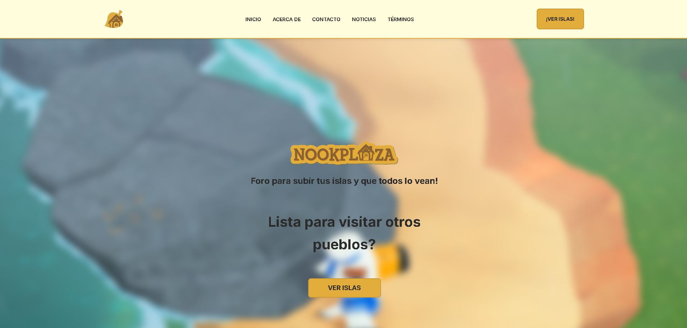
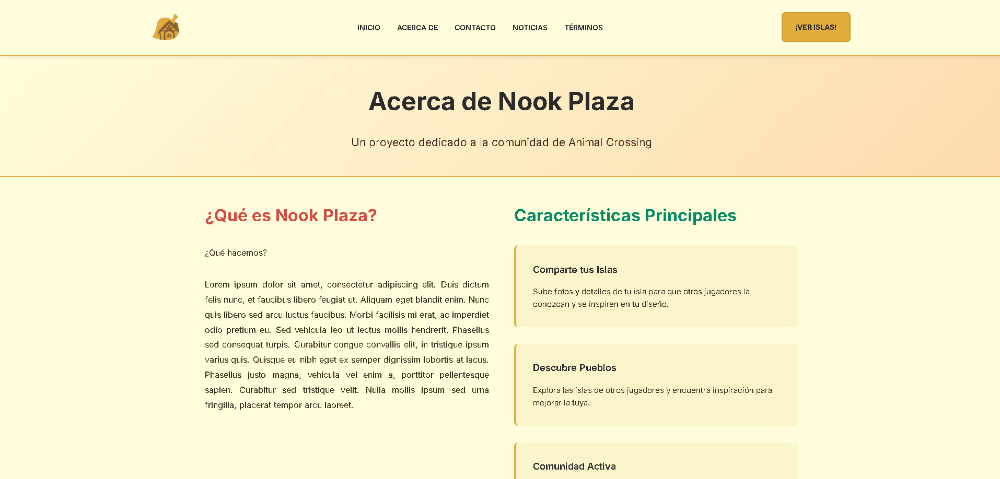
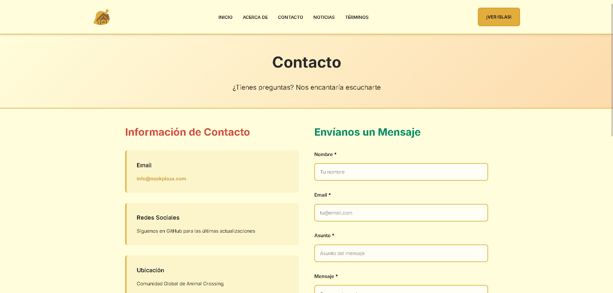
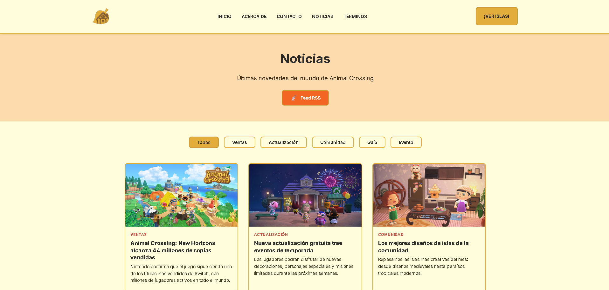
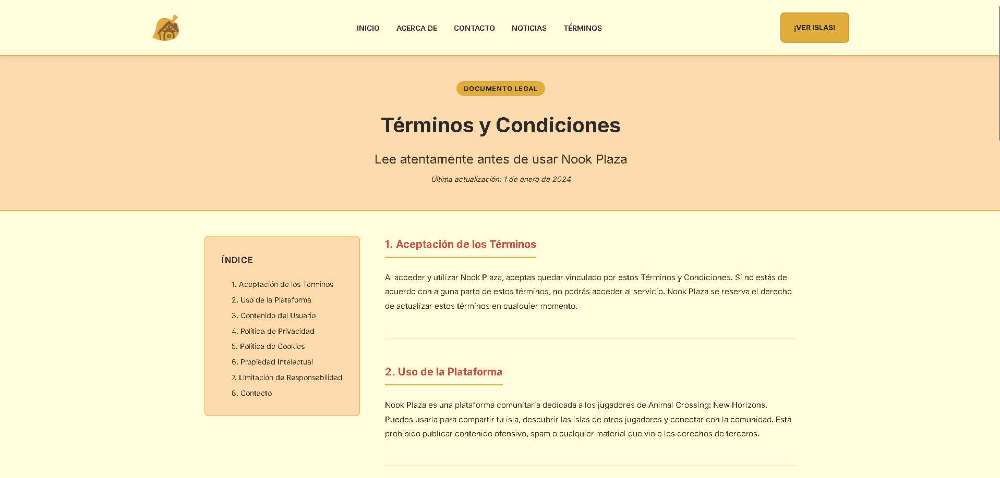
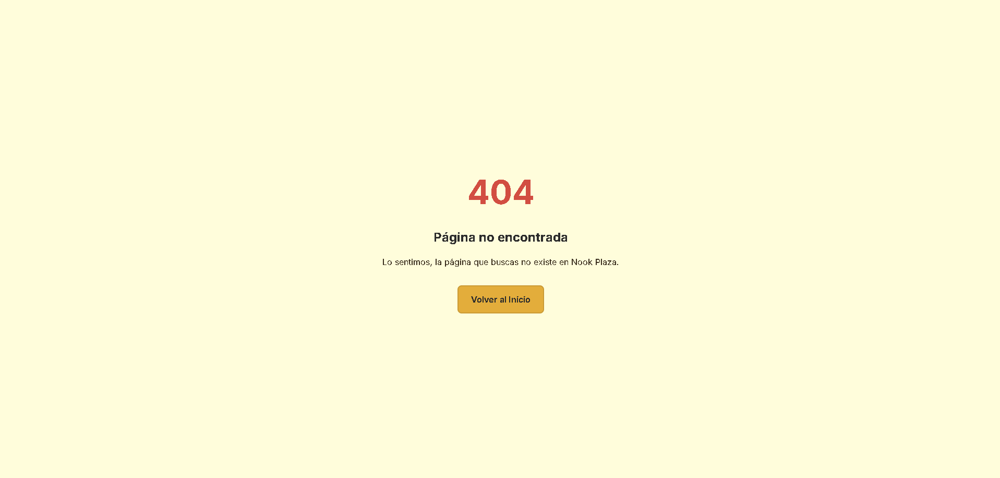

# 🏝️ Nook Plaza


> A community platform inspired by the Animal Crossing universe to give visibility to players' islands and preserve memories of their in-game worlds.

🌐 **Live Demo:** [https://nook-plaza-7babb.web.app/](https://nook-plaza-7babb.web.app/)

---

## 📋 Table of Contents

- [Overview](#-overview)
- [About the Project](#-about-the-project)
- [Features](#-features)
- [Screenshots](#️-screenshots)
- [Getting Started](#-getting-started)
- [Technologies](#-technologies)
- [Project Structure](#-project-structure)
- [Pages](#-pages)
- [Acknowledgements](#-acknowledgements)
- [Author](#️-author)
- [License](#-license)

---

## 📸 Overview


---

## 🌴 About the Project

**Nook Plaza** is a fan-made community website dedicated to the Animal Crossing universe. It was built with the goal of giving players a space to showcase their islands, discover other players' creations, and keep a living record of their in-game memories.

The platform allows users to explore islands from the community, discover villagers (vecinos), and connect with fellow Animal Crossing fans. The website is fully responsive, ensuring a seamless experience across desktop and mobile devices.

---

## ✨ Features

- 🏝️ **Island Showcase** — Browse and explore islands shared by the community
- 🦝 **Villager Discovery** — Find and discover villagers from other players' islands
- 🔍 **Category Filters** — Filter content by All, Pueblos, or Vecinos
- 📰 **Community News** — Stay up to date with the latest community updates
- 📬 **Contact Form** — Reach out and connect with the community
- 📱 **Fully Responsive** — Optimized for both desktop and mobile devices

---

## 🖼️ Screenshots

### 🏠 Home
> Main landing page with island showcase and category filters (All, Pueblos, Vecinos).



---

### ℹ️ About
> Information about the Nook Plaza project and its features.



---

### 📬 Contact
> Contact form for the community.



---

### 📰 News
> Latest news and updates from the community.



---

### 📜 Terms
> Terms and conditions of use.



---

### 🚫 404 Not Found
> Custom error page.



---

## 🚀 Getting Started

### Prerequisites

Make sure you have the following installed before running the project:

- [Node.js](https://nodejs.org/) v18 or higher
- [npm](https://www.npmjs.com/) v9 or higher

### Clone Repository

```bash
git clone https://github.com/your-username/nook-plaza
```

### Install Dependencies

```bash
cd nook-plaza
npm install
```

### Run Development Server

```bash
npm run dev
```

### Build for Production

```bash
npm run build
```

Open the browser and navigate to `http://localhost:5173` to view the app.

---

## 🧩 Technologies

| Technology | Version | Description |
|---|---|---|
| [React](https://react.dev/) | 18 | UI library |
| [Vite](https://vitejs.dev/) | 5 | Build tool and dev server |
| [Firebase](https://firebase.google.com/) | Latest | Backend, database and authentication |
| [Wouter](https://github.com/molefrog/wouter) | Latest | Lightweight client-side routing |
| CSS3 Modules | — | Per-component scoped styles |

---

## 📂 Project Structure

```
nook-plaza/
│
├── package.json
├── vite.config.js
├── README.md
│
├── client/
│   ├── public/
│   └── src/
│       ├── assets/
│       │   ├── bg/           # Background images
│       │   ├── card/         # Card images
│       │   ├── icon/         # Icons
│       │   └── pj/           # Character assets
│       ├── components/
│       │   ├── Footer/
│       │   ├── Header/
│       │   ├── IslandCard/
│       │   ├── IslandForm/
│       │   └── NewsCard/
│       ├── data/             # Static data
│       ├── firebase/         # Firebase setup
│       ├── pages/
│       │   ├── About/
│       │   ├── Contact/
│       │   ├── Home/
│       │   ├── News/
│       │   ├── NotFound/
│       │   └── Terms/
│       └── styles/           # Global styles
│
└── dist/                     # Production build
```

---

## 📄 Pages

| Page | Route | Description |
|---|---|---|
| **Home** | `/` | Main landing page with island showcase and category filters |
| **About** | `/about` | Information about the Nook Plaza project and its features |
| **Contact** | `/contact` | Contact form for the community |
| **News** | `/news` | Latest community news and updates |
| **Terms** | `/terms` | Terms of use |
| **404 Not Found** | `*` | Custom error page |

---

## 🙏 Acknowledgements

Special thanks to the following people for their contributions and support:

- [@Ixf2](https://github.com/Ixf2)

---

## ✒️ Author

**Víctor Gabriel Vergara Alejandro**

---

## 📝 License

This project is licensed under the [MIT](LICENSE) license.